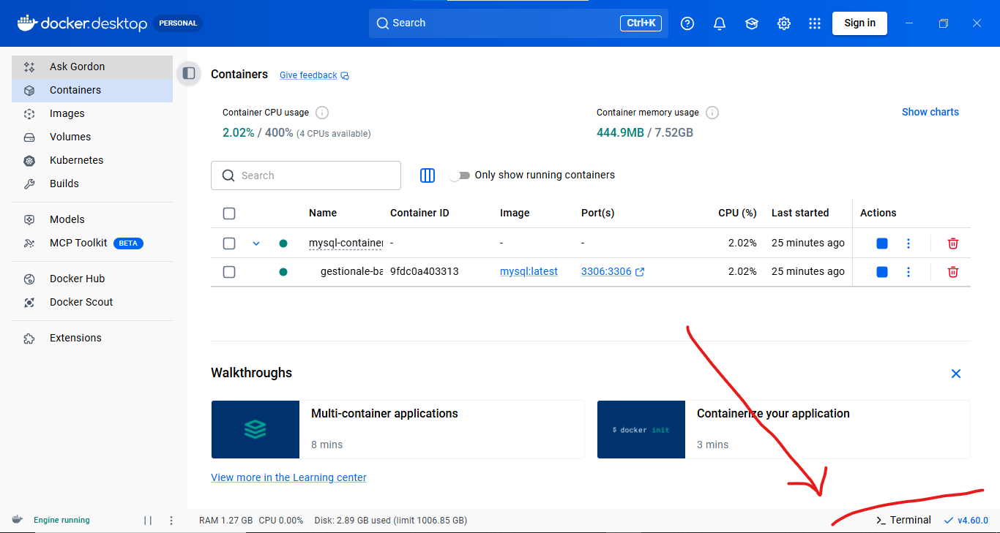
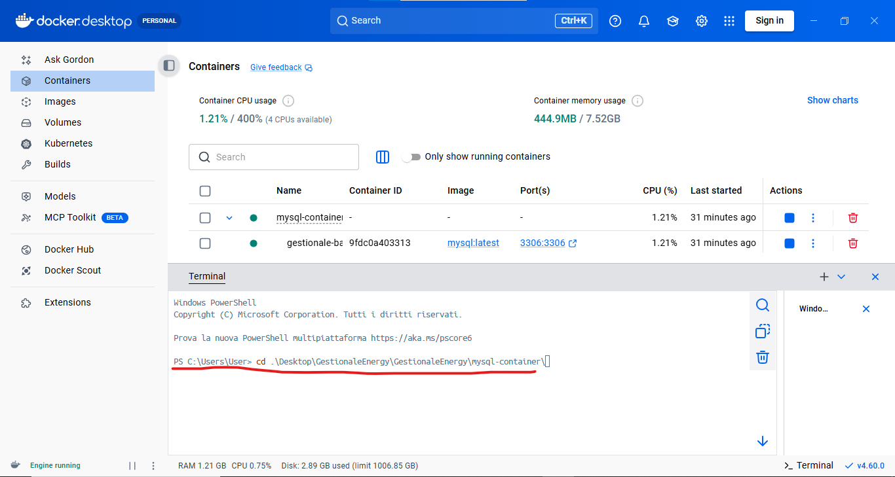
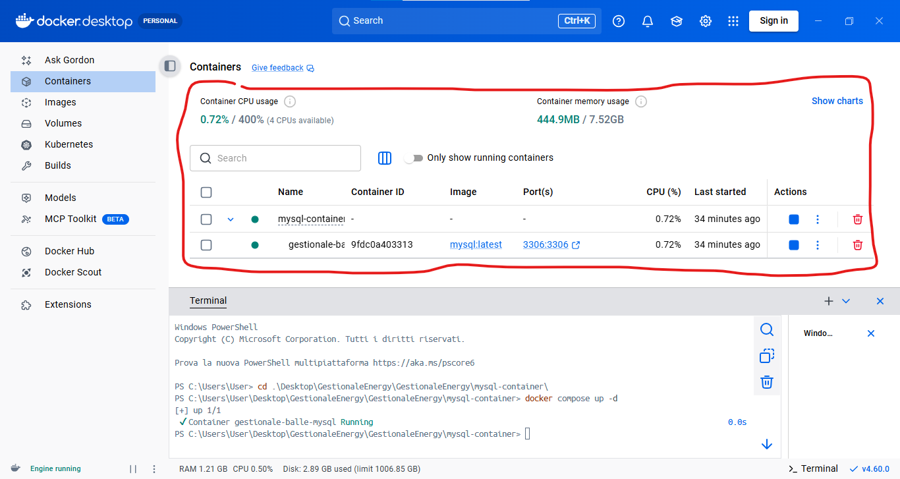

# Container Docker Mysql

> :warning: Attenzione! \
> Accertarsi che il file `.env` contenga le giuste credenziali per l'accesso al database:
> ```env 
> NEXT_PUBLIC_APP_DB_USERNAME=admin
> NEXT_PUBLIC_APP_DB_PASSWORD=admin
> NEXT_PUBLIC_APP_DB_HOST="127.0.0.1"
> NEXT_PUBLIC_APP_DB_NAME="on_gestionale_balle"
> NEXT_PUBLIC_APP_DB_PORT=3306
> ```

### Indice

- [Schema database](#schema-database)
- [Docker compose](#docker-compose-file)

## Schema database

Lo schema del database è all'interno di `/mysql/init/schema.sql`

## Docker compose file

### Informazioni sul container

- **Nome container**: `gestionale-balle-mysql`
- **Porta di default**: `3306`
- **Versione MySQL**: ultima
- **Utente e password**: admin, admin

> :warning: Attenzione! \
> L'importazione dei dati dello schema del database, verrà fatto solo alla prima creazione, nei casi successivi non verrà mai più sovrascritto, perciò, in caso di modifiche allo schema del database, dovrà essere eseguito il comando `docker compose down` prima di avviare di un nuovo il container

## Avvio del container docker

### Verificare l'installazione di **docker engine**

#### Windows

##### 1. Verifica installazione 

Se non è presente l'applicazione per windows **Docker Desktop**, scaricarla a questo link: [Docker Desktop per Windows](https://docs.docker.com/desktop/setup/install/windows-install/).

##### 2. Configurazione

Su **Docker Desktop** aprire il terminale con il pulsante in basso a destra \


Nel terminale che si aprirà cliccare su **"Start New Terminal"** e spostarsi sulla cartella `mysql-container` del progetto. \


Dopo essersi spostati sulla cartella eseguire il comando: `docker compose up -d`. \
Alla fine, se chiudete con la croce in alto a destra del terminale, vedrete il container andare in stato di **esecuzione**.


#### Linux

##### 1. Verifica installazione

Controllare che sia presente il pacchetto di **docker** con `docker --version` e con `docker compose version`. \
Dopodichè controllare che sia in esecuzione con `sudo systemctl status docker`. \
Nel caso non sia installato:
```
sudo apt-get update
sudo apt-get install docker-compose-plugin
```
E verificare il tutot con `docker compose version`.

##### 2. Configurazione

Spostarsi sulla cartella del progetto `mysql-container` ed eseguire il comando:
```
docker compose up -d
```

Verificare la correttezza del avvio del container in quesot modo:
```
docker ps
```
Se restituisce un riga con il nome del container e le porte impostate correttamente, funziona.

